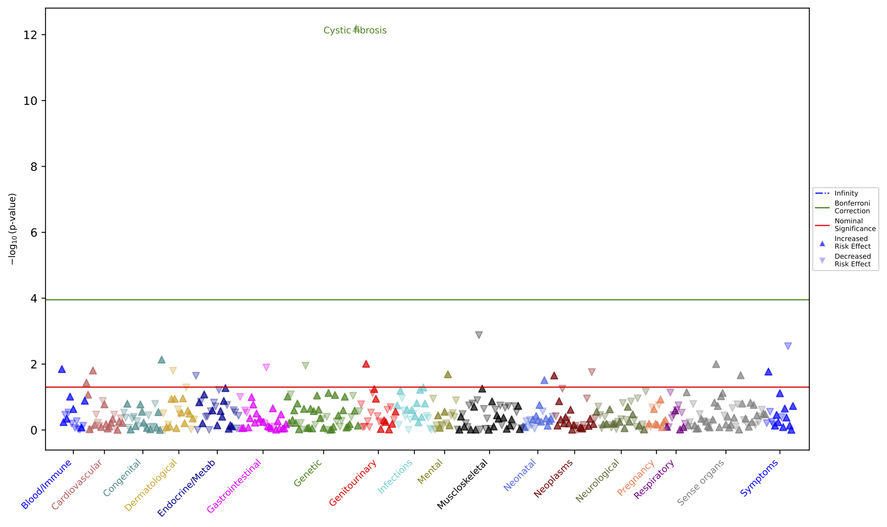

# PheTK - The Phenotype Toolkit
The official repository of PheTK.

## 1. INSTALLATION
PheTK can be installed using pip install command in a terminal (Python 3.7 or newer):

```
pip install PheTK
```

or Jupyter Notebook (restart kernel after installation and prior to importing):
```
!pip install PheTK
```

If and older version of PheTK was installed previously, it is best to uninstall it before new installation
```
pip uninstall PheTK -y && pip install PheTK
```

## 2. SYSTEM REQUIREMENTS
As PheTK utilizes multithreading to speed up computational processes, the more CPUs/cores the system has, 
the faster it would run.
Memory requirement would vary based on computing platform, user actual workflow and how efficient it is.

In our test, a PheWAS for a cohort of 400,000+ participants and 12 covariates successfully completed on a 
MacBook Pro M2 Pro 12 CPU cores 32GB RAM in ~81 minutes; 
PheWAS for the same cohort took ~12 minutes with a cloud instance of 96 CPUs 370GB RAM 
(memory choice here is mainly for redundancy and for comparison with other tests that we did).

In short, the more CPUs the better and RAM should be adequate for user workflow.

## 3. 1-MINUTE PHEWAS DEMO

User can run the quick 1-minute PheWAS demo with the following command in a terminal:

```
python3 -m PheTK.Demo
```

Or in Jupyter Notebook:

```
from PheTK import Demo

Demo.run()
```

## 4. DESCRIPTIONS
PheTK is a fast python library for Phenome Wide Association Studies (PheWAS) utilizing both phecode 1.2 and phecodeX 1.0.

### 4.1. PheWAS workflow and PheTK modules

Standard PheWAS workflow. Green texts are PheTK module names. 
Black components are supported while gray ones are not supported by PheTK currently.

### 4.2. PheTK module descriptions
This table will be updated as we update PheTK.

| Module  | Class   | Method(s)     | Platform    | Requirements/Notes                                                           |
|---------|---------|---------------|-------------|------------------------------------------------------------------------------|
| Cohort  | Cohort  | by_genotype   | _All of Us_ | None                                                                         |
|         |         |               | Other       | Variant data stored in Hail matrix table                                     |
|         |         | add_covariate | _All of Us_ | None                                                                         |
|         |         |               | Other       | Google BigQuery OMOP database                                                |
|         |         |               |             | Required tables: person, condition_occurrence, observation, death, & concept |
| Phecode | Phecode | count_phecode | _All of Us_ | None                                                                         | 
|         |         |               | Other       | User provided cohort ICD code data                                           |
|         |         |               |             | User can use custom ICD-to-phecode mapping table.                            |
| PheWAS  | PheWAS  | all methods   | Any         | None                                                                         |
| Plot    | Plot    | all methods   | Any         | None                                                                         |
| Demo    |         | all methods   | Any         | None                                                                         |

_All of Us_: the _All of Us_ Research Program (https://allofus.nih.gov/)

## 5. USAGE

### 5.1. Cohort module
Cohort module can be used for generating genetic cohort and add certain covariates to a cohort.

#### 5.1.1. by_genotype

This function takes genetic variant information as input, 
and generates cohort with matching genotypes as an output csv file.

For example, we generate cohort for _CFTR_ variant chr7-117559590-ATCT-A with 
heterozygous (0/1 genotype) participants as cases and homozygous reference (0/0 genotype) participants as controls.

#### Jupyter Notebook example for _All of Us_ Researcher Workbench:
For _All of Us_ data version 7, the default Hail matrix table is the ACAF (common variant) table.
User can use a different table by providing table location in the mt_path parameter.
```
from PheTK.Cohort import Cohort

# instantiate class Cohort object for _All of Us_ database version 7
cohort = Cohort(platform="aou", aou_db_version=7)

# generate cohort by genotype
cohort.by_genotype(
    chromosome_number=7,
    genomic_position=117559590,
    ref_allele="ATCT",
    alt_allele="A",
    case_gt="0/1",
    control_gt="0/0",
    reference_genome="GRCh38",
    mt_path=None,
    output_file_name="cftr_cohort.csv"
)
```

#### Jupyter Notebook example for other platforms:
For other platforms, user need to provide the location of Hail matrix table file for mt_path parameter.
```
from PheTK.Cohort import Cohort

# instantiate class Cohort object for _All of Us_ database version 7
cohort = Cohort(platform="custom")

# generate cohort by genotype
cohort.by_genotype(
    chromosome_number=7,
    genomic_position=117559590,
    ref_allele="ATCT",
    alt_allele="A",
    case_gt="0/1",
    control_gt="0/0",
    reference_genome="GRCh38",
    mt_path="/path/to/hail_matrix_table.mt",
    output_file_name="cftr_cohort.csv"
)
```

#### 5.1.2. add_covariates
This function is currently customized for the _All of Us_ Research Platform. 
It takes a cohort csv file and covariate selection as input, 
and generate a new cohort csv file with covariate data added as output. 
Input cohort data must have "person_id" column.

For non-_All of Us_ platforms, a Google BigQuery dataset ID must be provided.

In this example, we are adding age at last diagnosis event, sex at birth and 10 genetic PCs (provided by _All of Us_).
These options were set to True (or 10 in case of first_n_pcs).

The covariates shown in this example are currently supported by PheTK. Users should only change parameter value to True 
for covariates to be used in subsequent PheWAS. All parameters are set to False by default, i.e., user only need to 
specify parameters of interest as shown in the "short version".

#### Jupyter Notebook example for _All of Us_ Researcher Workbench:
```
# user can skip the import and instantiation steps if running continuously 
# from previous by_genotype example, i.e., skip directly to add covariates step.
from PheTK.Cohort import Cohort

# instantiate class Cohort object for _All of Us_ database version 7
cohort = Cohort(platform="aou", aou_db_version=7)

# RUN EITHER LONG OR SHORT VERSION BELOW
# add covariates - long version, including all currently supported covariate options
cohort.add_covariates(
    cohort_csv_path="cftr_cohort.csv",
    natural_age=False,
    age_at_last_event=True,
    sex_at_birth=True,
    ehr_length=False,
    dx_code_occurrence_count=False,
    dx_condition_count=False,
    genetic_ancestry=False,
    first_n_pcs=10,
    drop_nulls=True,
    output_file_name="cohort_with_covariates.csv"
)

# add covariates - short version, i.e., users do not need to list unused covariates
cohort.add_covariates(
    cohort_csv_path="cftr_cohort.csv",
    age_at_last_event=True,
    sex_at_birth=True,
    first_n_pcs=10,
    drop_nulls=True,
    output_file_name="cohort_with_covariates.csv"
)
```

Notes:
- In the "long_version" example, "genetic_ancestry" will return string values of predicted ancestries, 
e.g., "eur", "afr", etc. 
These are only useful if user would like to filter data by genetic ancestries. 
Genetic PCs (from first_n_pcs parameter) is the better option for genetic ancestry adjustment in PheWAS.

#### Jupyter Notebook example for other platforms with OMOP data stored in Google BigQuery:
The only difference in this case is that user need to provide dataset ID for gbq_dataset_id parameter.
The rest should be the same as above example.
Please make sure the custom database meet the requirements in section 4.2.
```
from PheTK.Cohort import Cohort

cohort = Cohort(platform="custom", gbq_dataset_id="Google_BigQuery_dataset_id")
```

### 5.2. Phecode module
Phecode module is used to retrieve ICD code data of participants, map ICD codes to phecode 1.2 or phecodeX 1.0, 
and aggregate the counts for each phecode of each participant.

The ICD code retrieval is done automatically for _All of Us_ platform when users instantiate class Phecode.
For other platforms, users must provide your own ICD code data.

Example of ICD code data: 
- Each row must be unique, i.e., there should not be 2 instances of 1 ICD code in the same day.
- Data must have these exact column names. "date" column is not used for later ICD-to-phecode mapping, 
but should be included to make sure ICD events occurred on unique dates. 

| person_id | date      | vocabulary_id | ICD   |
|-----------|-----------|---------------|-------|
| 13579     | 1-11-2010 | ICD9CM        | 786.2 |
| 13579     | 1-31-2010 | ICD9CM        | 786.2 |
| 13579     | 12-4-2017 | ICD10CM       | R05.1 |
| 24680     | 3-12-2012 | ICD9CM        | 659.2 |
| 24680     | 4-18-2018 | ICD10CM       | R50   |

In these examples, we will map US ICD codes (ICD-9-CM & ICD-10-CM) to phecodeX for _All of Us_ and custom platforms.

#### Jupyter Notebook example for _All of Us_:
```
from PheTK.Phecode import Phecode

phecode = Phecode(platform="aou")
phecode.count_phecode(
    phecode_version="X", 
    icd_version="US",
    phecode_map_file_path=None, 
    output_file_name="my_phecode_counts.csv"
)
```

#### Jupyter Notebook example for other platforms
```
from PheTK.Phecode import Phecode

phecode = Phecode(platform="custom", icd_file_path="/path/to/my_icd_data.csv")
phecode.count_phecode(
    phecode_version="X", 
    icd_version="US", 
    phecode_map_file_path=None,
    output_file_name="my_phecode_counts.csv"
)
```

In both examples, users can provide their own phecode mapping file by adding a csv file path to phecode_map_file_path.

### 5.3. PheWAS module
It is recommended to run Demo example above and have a look at example cohort and phecode counts file to 
be familiar with input data format. The example files should be generated in user's current working directory.

PheWAS class is instantiated with paths to csv files of cohort data and phecode counts data,
in addition to other parameters as shown in the examples below.
It can be used in both Linux command line interface (CLI) and any Python environment, e.g., 
Jupyter Notebook/Lab.

In these example, we would like to run PheWAS with phecodeX for example data generated by Demo module, 
with age, sex and 3 genetic PCs as covariates, and an independent variable of interest 
(for which PheWAS summary statistics will be generated).
For each phecode, a participant must have a minimum count of 2 phecode events to be considered a case.
There must be at least 50 cases and 50 controls for the phecode to be tested.

#### CLI example:
```
python3 -m PheTK.PheWAS \
--phecode_version X \
--cohort_csv_path example_cohort.csv \
--phecode_count_csv_path example_phecode_counts.csv \
--sex_at_birth_col sex \
--male_as_one True \
--covariates age sex pc1 pc2 pc3 \
--independent_variable_of_interest independent_variable_of_interest \
--min_case 50 \
--min_phecode_count 2 \
--output_file_name example_phewas_results.csv
```

#### Jupyter Notebook example:
```
from PheTK.PheWAS import PheWAS

example_phewas = PheWAS(
    phecode_version="X",
    phecode_count_csv_path="example_phecode_counts.csv",
    cohort_csv_path="example_cohort.csv",
    sex_at_birth_col="sex",
    male_as_one=True,
    covariate_cols=["age", "sex", "pc1", "pc2", "pc3"],
    independent_variable_of_interest="independent_variable_of_interest",
    min_cases=50,
    min_phecode_count=2,
    output_file_name="example_phewas_results.csv"
)
example_phewas.run()
```

Notes:
- Each entry in sex_at_birth column should be either 0 or 1 for female or male. The default is male = 1 and female = 0.
- User can use male_as_one to specify where male was coded as 1 (male_as_one=True) or 0 (male_as_one=False).
- In the above example, "sex" column was declared twice, once in sex_at_birth_col and once in covariate_cols.
sex_at_birth_col is always required as certain phecodes are sex restricted.
If user would like to use sex as a covariate, sex column must be included in covariate_cols. 

### 5.4. Plot module
Plot class is instantiated with path to PheWAS result csv file.
After that, a plot type method can be called to generate a plot, 
e.g., calling manhattan() method to make Manhattan plot.

In this example, we are generating a Manhattan plot for the PheWAS results created by module Demo.

#### Jupyter Notebook example:
```
from PheTK.Plot import Plot

p = Plot("example_phewas_results.csv")
p.manhattpan(label_values="p_value", label_count=1, save_plot=True)
```
The above code example generates this Manhattan plot figure:



Details on plot customization options will be provided in a separate document in the near future.

## 6. CONTACT

PheTK@mail.nih.gov

## 7. CITATION

Preprint version:
https://www.medrxiv.org/content/10.1101/2024.02.12.24302720v1

Peer reviewed version:
TBD
