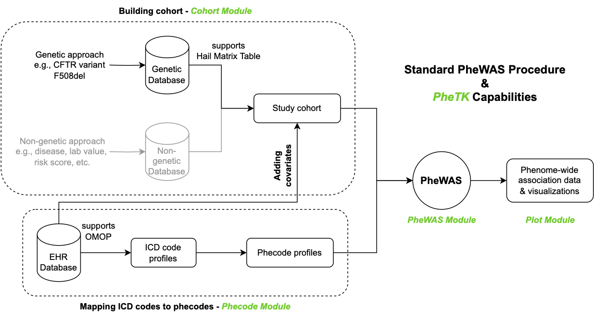

# PheTK - The Phenotype Toolkit
The official repository of PheTK, a fast python library for Phenome Wide Association Studies (PheWAS) utilizing both phecode 1.2 and phecodeX 1.0.

__Reference__: Tam C Tran, David J Schlueter, Chenjie Zeng, Huan Mo, Robert J Carroll, Joshua C Denny, PheWAS analysis on large-scale biobank data with PheTK, Bioinformatics, Volume 41, Issue 1, January 2025, btae719, https://doi.org/10.1093/bioinformatics/btae719

__Contact__: [PheTK@mail.nih.gov](mailto:PheTK@mail.nih.gov)

## 🆕 WHAT'S NEW IN v0.2
Major updates in this release:
- **Cox regression support** - Added survival analysis capabilities alongside logistic regression
- **dsub integration** - Built-in support for distributed computing on Google Cloud Platform
- **Forest plot visualization** - New main visualization option alongside Manhattan plots
- **PEP-compliant naming** - Changed to lowercase package/module names (affects import syntax)
- **Expanded CLI support** - Added command-line interfaces for cohort and phecode modules
- **Simplified CLI commands** - Added entry points for easier CLI usage (e.g., `phetk phewas` instead of `python3 -m phetk.phewas`)
- **Enhanced user experience** - Various improvements for clarity and usability

[**📋 View full changelog**](https://github.com/nhgritctran/PheTK/releases) | [**⬆️ Migration guide**](https://github.com/nhgritctran/PheTK/releases)

***

## QUICK LINKS
- [Installation](#1-installation)
- [System requirements & computing resources](#2-system-requirements--computing-resources)
- [1-minute PheWAS demo](#3-1-minute-phewas-demo)
- [PheTK description](#4-descriptions)
- [Usage examples](#5-usage)
  - [Cohort module](docs/cohort-module.md)
  - [Phecode module](docs/phecode-module.md)
  - [PheWAS module](docs/phewas-module.md)
  - [Plot module](docs/plot-module.md)
- Platform specific tutorial(s):
  - ___All of Us___: [APOE PheWAS jupyter notebook](https://workbench.researchallofus.org/workspaces/aou-rw-42a1ea44/chargedemo/analysis/preview/2_PheWAS_with_PheTK_demo.ipynb).
This notebook demonstrates PheTK usage on the _All of Us_ Researcher Workbench with APOE PheWAS as a study example.
Please note that this link is only accessible to _All of Us_ registered users.
- [Changelogs and releases](https://github.com/nhgritctran/PheTK/releases): 
from v0.1.45, please use [GitHub Releases](https://github.com/nhgritctran/PheTK/releases) for the latest versions and changelogs. 
Legacy changelogs were archived in [CHANGELOG.md](legacy/CHANGELOG.md).
- Resource to learn about PheWAS and phecode: [The PheWAS Catalog](https://phewascatalog.org/).

***

## 1. INSTALLATION
The latest version of PheTK can be installed using the pip install command in the terminal (Python 3.7 or newer):

```
pip install phetk --upgrade
```

or Jupyter Notebook (restart kernel after installation and prior to importing):
```
!pip install phetk --upgrade
```

To check current installed version:
```
pip show phetk | grep Version
```

## 2. SYSTEM REQUIREMENTS & COMPUTING RESOURCES

PheTK was developed for efficient processing of large data while being resource-friendly. 
It was tested on different platforms from laptops to different cloud environments.

### General Requirements
PheTK's resource requirements vary by analysis method:

#### Logistic Regression
- **Minimal resources required** - Can run efficiently on lightweight configurations
- **Minimum tested configuration**: GCP `X-highcpu-4` (4 vCPUs, 8GB RAM, X=GCP machine type, e.g., c2d) or equivalent
- Uses multithreading for parallel processing with lower memory overhead

#### Cox Regression  
- **Slightly higher resources required** - Uses multiprocessing which demands more memory
- **Minimum tested configuration**: GCP `X-standard-4` (4 vCPUs, 16GB RAM, X=GCP machine type, e.g., c2d) or equivalent
- The additional memory accommodates the multiprocessing overhead for survival analysis

#### Phecode Module (ICD Code Mapping)
- **Memory requirements scale with cohort size** - Large cohorts require higher memory configurations
- **Recommended**: For _All of Us_ database v8 with over 500k participants, phecode mapping could be done with a 16 vCPU 104GB RAM machine.

### General Guidelines
- **All PheTK functions run on standard machines**, except `by_genotype()` in the Cohort module which requires a Spark cluster (dataproc VM)
- Both analysis methods scale well to certain CPU counts for faster processing. See figure S2 below for more information.
- In our experience, 4 CPU machines are the most cost-efficient, especially for large-scale analyses.

In practice, users could try different available machine configurations to achieve optimal performance and cost-effectiveness.


**Figure S2**: Logistic regression performance benchmarks from PheTK publication showing scalability with different CPU configurations and cohort sizes.

## 3. 1-MINUTE PHEWAS DEMO

User can run the quick 1-minute PheWAS demo with the following command in a terminal:

```
python3 -m phetk.demo
```

Or in Jupyter Notebook:

```
from phetk import demo

demo.run()
```

The example files (`example_cohort.tsv`, `example_phecode_counts.tsv`, and `example_phewas_results.tsv`) 
generated in this Demo should be in users' current working directory. 
New-to-PheWAS users could explore these files to get a sense of what data are used or generated in PheWAS with PheTK.

## 4. DESCRIPTIONS
PheTK is a fast python library for Phenome Wide Association Studies (PheWAS) utilizing both phecode 1.2 and phecodeX 1.0.


Standard PheWAS workflow. Green italicized texts are PheTK module names. 
Black components are supported while gray ones are not supported by PheTK currently.

_All of Us_: the _All of Us_ Research Program (https://allofus.nih.gov/)

## 5. USAGE

For detailed usage examples and documentation for each module, please refer to the individual module documentation:

- **[Cohort module](docs/cohort-module.md)** - Generate genetic cohorts and add covariates
- **[Phecode module](docs/phecode-module.md)** - Map ICD codes to phecodes and generate counts
- **[PheWAS module](docs/phewas-module.md)** - Run PheWAS analysis with logistic or Cox regression
- **[Plot module](docs/plot-module.md)** - Generate Manhattan plots and other visualizations

