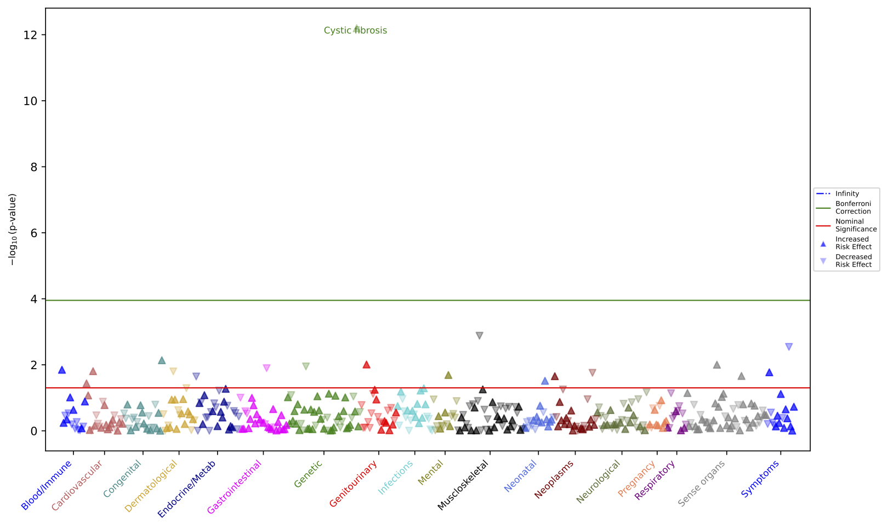

# Plot Module

Plot class is instantiated with the path to PheWAS result csv/tsv file.
After that, a plot type method can be called to generate a plot, 
e.g., calling manhattan() method to make Manhattan plot.

In this example, we are generating a Manhattan plot for the PheWAS results created by module Demo.

## Demo Jupyter Notebook example:
```python
from PheTK.Plot import Plot

p = Plot("example_phewas_results.tsv")
p.manhattan(label_values="p_value", label_count=1, save_plot=True)
```
The above code example generates this Manhattan plot figure:



## Main customization options:
The features below can be used individually or in combinations to customize Manhattan Plot.

### Plot only converged phecodes:
As mentioned in PheWAS module above, PheWAS results contain both converged and non-converged phecodes.
By default, PheTK will exclude non-converged phecodes when plotting for better interpretation.

Users can include non-converged phecodes by setting boolean parameter `converged_only` to `False`:
```python
p = Plot("example_phewas_results.tsv", converged_only=False)
```

### Set custom Bonferroni value/line:
```python
p = Plot("example_phewas_results.tsv", bonferroni=your_custom_value)
```

### Set custom color palette:
Color palette should be provided in a tuple format. Each color will be used for a phecode category.
If the number of colors is lower than the number of phecode categories, the colors will be cycled back to the first color and so on.
PheTK uses matplotlib color names.
```python
p = Plot("example_phewas_results.tsv", color_palette=("blue", "indianred", "darkcyan"))
```

### Use beta values (effect sizes) as marker size and change scale factor:
This feature can be turned on using boolean parameter `marker_size_by_beta` to `True`.
Users can adjust marker size using parameter `marker_scale_factor` which has a default value of 1.
(Note that this parameter only works when `marker_size_by_beta=True`).

```python
p.manhattan(marker_size_by_beta=True, marker_scale_factor=1)
```

### Select what to label
By default, PheTK will label by top p-values. This can be changed using parameter `label_values`.
This parameter accepts a single string value or list of phecodes, or 3 preset values of "p_value", "positive_beta", or "negative_beta".
Note that, if provided text values do not match the preset values or phecodes in PheWAS results, they will not be labeled.

Label by top p-values:
```python
p.manhattan(label_values="p_value")
```

Label by top positive beta values:
```python
p.manhattan(label_values="positive_beta")
```

Label by top negative beta values:
```python
p.manhattan(label_values="negative_beta")
```

Label by specific phecode(s) of interests:
```python
p.manhattan(label_values=["GE_982", "NS_351"])
```

### Number of data points to be labeled
By default, PheTK will label the top 10 data points of label values. To change this, use parameter `label_count`
```python
p.manhattan(label_count=10)
```

### Select phecode category to label
Users can choose to label only in a specific phecode category or multiple categories using parameter `phecode_categories`
```python
p.manhattan(phecode_categories=["Neoplasms", "Genetic"])
```

### Save plot
```python
p.manhattan(save_plot=True)
```

Further details on plot customization options will be provided in a separate document in the near future.